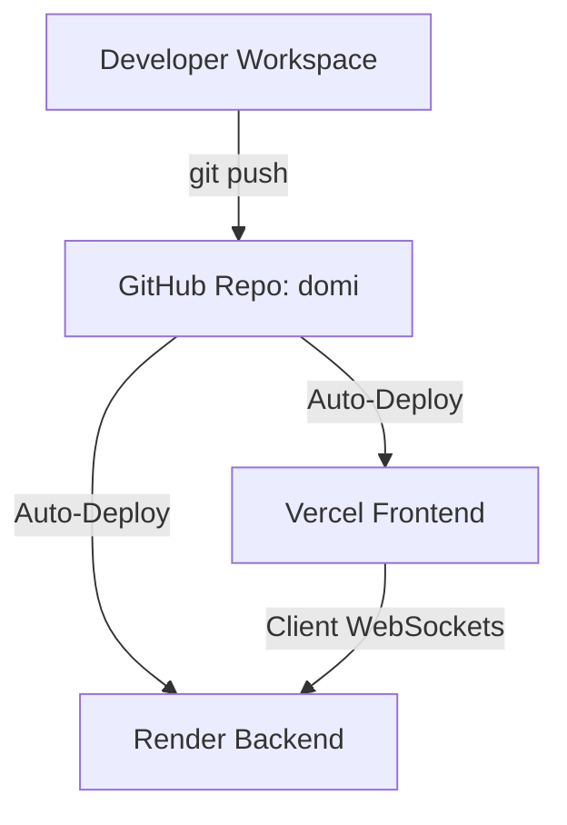

# Domino's Effect 🏁 — Production Deployment Guide

This guide details how to host **Domino's Effect** in production using a modern, scalable, and cost-free cloud setup:
1. **Frontend (Static Site)** hosted on **Vercel**
2. **Backend (Node.js/Socket.IO Web Service)** hosted on **Render**

---

## 🗺️ Deployment Architecture



- **Vercel** instantly compiles and serves the `blocks/` static assets (HTML, CSS, JS, and levels) via a global edge CDN.
- **Render** runs the Node.js Socket.IO server (`server/blockly_server.js`) to power real-time coordination, team levels, and failures broadcast.

---

## ⚡ Step 1: Deploy the Backend on Render (Render.com)

Since the frontend needs to connect to the backend, it's best to deploy your backend first to obtain its production URL.

1. **Sign Up / Log In**: Go to [Render](https://render.com/) and connect your GitHub account.
2. **Create Web Service**:
   - Click **New +** and select **Web Service**.
   - Connect your GitHub repository `https://github.com/dante007d/domi.git`.
3. **Configure the Service**:
   - **Name**: `dominos-effect-backend`
   - **Environment**: `Node`
   - **Region**: Select the region closest to your target players (e.g., Oregon, Frankfurt, Singapore).
   - **Branch**: `main`
   - **Root Directory**: `server` *(CRITICAL: Tell Render to look inside the `server/` folder)*
   - **Build Command**: `npm install`
   - **Start Command**: `node blockly_server.js`
   - **Instance Type**: `Free`
4. **Environment Variables**:
   - Under the **Environment** tab, click **Add Environment Variable**:
     - `PORT` = `3002` (Render will override this dynamically, but `3002` is a safe fallback).
     - `NODE_ENV` = `production`
5. **Deploy**: Click **Deploy Web Service**.
6. **Save your Backend URL**: Once deployed, Render will provide a public URL like `https://dominos-effect-backend.onrender.com`. Copy this URL!

---

## 🚀 Step 2: Configure the Backend URL in the Frontend

To allow your deployed frontend to automatically communicate with your new Render backend, you have two options:

### Option A: Automatic Fallback (Recommended)
You can edit the default fallback URL in the frontend source code so players don't have to configure anything.
Modify the fallback URL (`https://dominos-effect-f.up.railway.app`) in the following files to match your Render URL:

1. **`blocks/js/main.js`** (Line ~201):
   ```javascript
   const socketUrl = window.location.hostname === 'localhost' || window.location.hostname === '127.0.0.1'
       ? 'http://localhost:3002'
       : (localStorage.getItem('BACKEND_URL') || 'https://YOUR-RENDER-APP-NAME.onrender.com');
   ```
2. **`blocks/js/game.js`** (Line ~42):
   ```javascript
   const socketUrl = window.location.hostname === 'localhost' || window.location.hostname === '127.0.0.1'
       ? 'http://localhost:3002'
       : (localStorage.getItem('BACKEND_URL') || 'https://YOUR-RENDER-APP-NAME.onrender.com');
   ```
3. **`blocks/admin.html`** (Line ~487):
   ```javascript
   const socketUrl = window.location.hostname === 'localhost' || window.location.hostname === '127.0.0.1'
       ? 'http://localhost:3002'
       : (localStorage.getItem('BACKEND_URL') || 'https://YOUR-RENDER-APP-NAME.onrender.com');
   ```
4. **`blocks/shitttt/index.html`** (Line ~601):
   ```javascript
   const socketUrl = window.location.hostname === 'localhost' || window.location.hostname === '127.0.0.1'
       ? 'http://localhost:3002'
       : (localStorage.getItem('BACKEND_URL') || 'https://YOUR-RENDER-APP-NAME.onrender.com');
   ```

### Option B: LocalStorage Override
If you want to test multiple backends without changing code, open the browser console on your deployed frontend site and run:
```javascript
localStorage.setItem('BACKEND_URL', 'https://YOUR-RENDER-APP-NAME.onrender.com');
```

---

## 🌐 Step 3: Deploy the Frontend on Vercel (Vercel.com)

1. **Sign Up / Log In**: Go to [Vercel](https://vercel.com/) and log in with your GitHub account.
2. **Create New Project**:
   - Click **Add New** -> **Project**.
   - Import your GitHub repository `https://github.com/dante007d/domi.git`.
3. **Configure the Project**:
   - **Framework Preset**: Select `Other` (since this is static vanilla HTML/CSS/JS).
   - **Root Directory**: Click *Edit* and select the **`blocks`** directory *(CRITICAL: This serves `blocks/index.html` directly as the homepage!)*.
   - **Build & Development Settings**:
     - Build Command: Leave blank / override to none (since we only serve static assets).
     - Output Directory: Leave blank / default.
4. **Deploy**: Click **Deploy**.
5. **Success!** Vercel will instantly generate a live URL for your game, such as `https://domi-gamma.vercel.app`.

---

## 🔒 Production Troubleshooting & Best Practices

> [!NOTE]
> **Render Spin-Up Time**: Render's **Free Tier** web services spin down after 15 minutes of inactivity. When a player opens the game after a period of inactivity, the first connection might take 50–90 seconds while the backend server wakes up.

> [!TIP]
> **WebSocket Transport Support**: Since Vercel uses global serverless edge routers, they do not support persistent server WebSockets. That is why having the backend separated on **Render** (which supports full persistent WebSocket connections) is the optimal architectural pattern for multiplayer canvas games!
